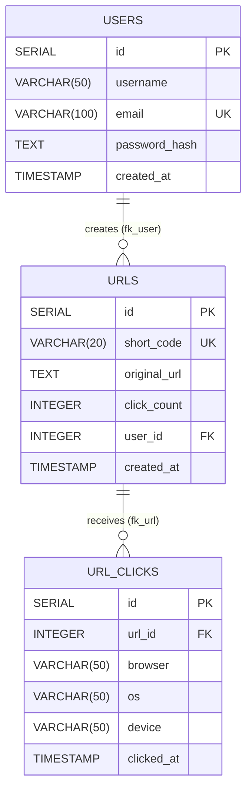

<div align="center">

# 🍵 shorTea
### A Fast, Secure, and Scalable URL Shortening Platform

*Shorten links, track analytics, and manage your URLs with a highly optimized backend infrastructure. <br> **Mobile App UI coming soon!***

<br>


</div>

---

## 🚀 Overview

**shorTea** is a robust URL shortener API built with a Clean Layered Architecture. It offers comprehensive analytics, secure user authentication, and safety checks like Google Safe Browsing integration. The backend is fully deployed, and a companion mobile application is currently in development.

### 🌍 Deployment
* **Backend Hosting:** [Render](https://render.com/)
* **Database:** [Neon (Serverless Postgres)](https://neon.tech/)

---

## 📋 Feature Highlights

### ⚡ Core Features
- ✅ **URL Shortening:** Generate clean, compact short codes.
- ✅ **Fast Redirects:** Highly optimized redirect handling.
- ✅ **Duplicate Detection:** Prevents clutter by identifying existing original URLs.
- ✅ **Google Safe Browsing:** Checks links for malware and phishing before shortening.
- ✅ **Click Counter:** Real-time tracking of URL hits.
- ✅ **Deep Analytics:** Tracks Browser, Operating System (OS), and Device types for every click.

### 🔐 Authentication & Authorization
- ✅ **User Registration & Login:** Secure account creation.
- ✅ **JWT Authentication:** Stateless, secure sessions.
- ✅ **Ownership Authorization:** Users can only manage and view stats for their own URLs.

### 🔗 URL Management
- ✅ **My URLs:** Retrieve a personalized list of shortened links.
- ✅ **Update & Delete:** Full CRUD capabilities for URL owners.
- ✅ **URL Stats & Browser Stats:** Detailed breakdowns of traffic sources.

### 🛠 API Features
- ✅ **Pagination:** Efficiently handle large datasets.
- ✅ **Search & Sorting:** Easily find and organize links.

### 🛡 Validation & Errors
- ✅ **Zod Validation:** Strict, type-safe request payload validation.
- ✅ **Centralized Error Handling:** Consistent and predictable API responses.
- ✅ **Async Handler:** Clean asynchronous controller logic without `try/catch` bloat.

### 🔒 Security
- ✅ **Helmet:** Secures Express apps by setting various HTTP headers.
- ✅ **Rate Limiting:** Protects the API from brute-force and DDoS attacks.
- ✅ **Compression:** Decreases the size of the response body, increasing speed.
- ✅ **Password Hashing:** Safely stores user credentials.

### 👨‍💻 Developer Experience (DX)
- ✅ **TypeScript:** End-to-end type safety.
- ✅ **Clean Layered Architecture:** Separation of concerns (Routes, Controllers, Services, Data Access).
- ✅ **Morgan Logging:** HTTP request logger middleware.
- ✅ **GitHub Actions CI:** Automated testing and integration pipelines.

---

## 🗄️ Database Architecture & Data Flow

Below is the Entity-Relationship (ER) diagram mapping out the PostgreSQL database schema for **shorTea**. 



---

## 🛠️ Getting Started (Local Development)

### Prerequisites
- Node.js (v18+)
- PostgreSQL

### Installation

1. **Clone the repository**
   ```bash
   git clone https://github.com/yourusername/shorTea.git
   cd shorTea
   ```

2. **Install dependencies**
   ```bash
   npm install
   ```

3. **Set up Environment Variables** 
   Create a `.env` file in the root directory and add the following:
   ```env
   PORT=5000
   DATABASE_URL=your_neon_postgres_connection_string
   JWT_SECRET=your_jwt_secret
   GOOGLE_SAFE_BROWSING_API_KEY=your_api_key
   ```

4. **Run the development server**
   ```bash
   npm run dev
   ```

---
<div align="center">
<i>📱 Note on Frontend: The UI is currently under development as a mobile application. Stay tuned for updates!</i>
</div>
