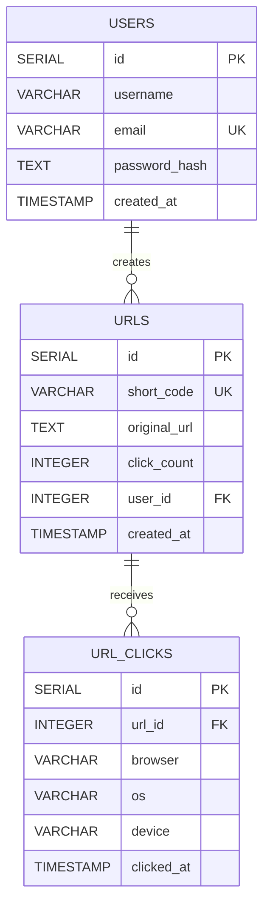

<div align="center">

# 🍵 shorTea
### A Fast, Secure, and Scalable URL Shortening Platform

*Shorten links, create custom aliases, track analytics, report bugs, and manage your URLs with a highly optimized backend infrastructure.*

<br>


</div>

---

# 🚀 Overview

**shorTea** is a production-ready URL shortening platform built using a Clean Layered Architecture. It provides secure authentication, custom aliases, comprehensive analytics, Google Safe Browsing integration, bug reporting via email, and efficient URL management.

The backend is fully deployed on **Render** with a **Neon PostgreSQL** database, while the Android application is actively being developed using **Kotlin**, **Jetpack Compose**, **MVVM**, and **Material 3**.

---

# 🌍 Deployment

- **Backend:** https://shortea.onrender.com
- **Hosting:** Render
- **Database:** Neon PostgreSQL

---

# 📱 Android Application

The companion Android application communicates directly with the deployed backend and is built using:

- Kotlin
- Jetpack Compose
- MVVM
- Retrofit
- DataStore
- Material 3

### Current Features

- 🔐 JWT Authentication
- 🔗 Create Short URLs
- ✏️ Edit URLs & Custom Aliases
- 🗑 Delete URLs
- 📊 Dashboard with Analytics
- 🐞 Report Bugs & Feedback
- 👤 Profile Screen
- 📱 Modern Material 3 UI

### Repository

👉 **Android App**

https://github.com/komallsingh/shortTea-App

---

# 📋 Feature Highlights

## ⚡ Core Features

- [x] URL Shortening
- [x] Custom Aliases
- [x] Fast Redirects
- [x] Duplicate URL Detection
- [x] Google Safe Browsing Integration
- [x] Click Counter
- [x] Browser Analytics
- [x] Device Analytics
- [x] Operating System Analytics
- [x] Bug & Feedback Reporting
- [x] QR Code Generation, Saving and Sharing
---

## 🔐 Authentication & Authorization

- [x] User Registration
- [x] User Login
- [x] JWT Authentication
- [x] Password Hashing
- [x] Protected Routes
- [x] Ownership Authorization

---

## 🔗 URL Management

- [x] Create Short URLs
- [x] Create Custom Aliases
- [x] Retrieve User URLs
- [x] Edit Original URLs
- [x] Edit Custom Aliases
- [x] Delete URLs
- [x] URL Statistics
- [x] Browser Statistics
- [x] QR Code Generation, Saving and Sharing
---

## 📊 Analytics

- [x] Total Click Count
- [x] Browser Breakdown
- [x] Operating System Breakdown
- [x] Device Breakdown
- [x] Click Tracking

---

## 📧 Feedback System

A built-in feedback system allows authenticated users to report bugs or submit feature requests directly from the Android application.

### Features

- [x] Report Bugs
- [x] Send Feature Requests
- [x] Email Notifications
- [x] Powered by Resend
- [x] Backend Validation
- [x] Instant Delivery to Developer Inbox

---

## 🛠 API Features

- [x] Pagination
- [x] Search
- [x] Sorting
- [x] Duplicate Detection
- [x] Clean REST APIs

---

## 🛡 Validation & Error Handling

- [x] Zod Validation
- [x] Async Handler
- [x] Centralized Error Handling
- [x] Production-ready Error Responses

---

## 🔒 Security

- [x] Helmet
- [x] Rate Limiting
- [x] Compression
- [x] Google Safe Browsing API
- [x] JWT Authentication
- [x] Password Hashing

---

# 📨 Bug Feedback Workflow

```
Android App
      │
      ▼
 Feedback Form
      │
      ▼
 Express API
      │
      ▼
 Input Validation
      │
      ▼
 Resend Email API
      │
      ▼
 Developer Inbox
```

---

# 🗄 Database Architecture



---

# 🏗 Architecture

```
Android App / Web Client
          │
          ▼
       Routes
          │
          ▼
    Controllers
          │
          ▼
      Services
          │
          ▼
   Repositories
          │
          ├───────────────┐
          ▼               ▼
 PostgreSQL         Resend Email API
```

---

# 🛠 Tech Stack

## Backend

- TypeScript
- Node.js
- Express.js
- PostgreSQL
- Neon
- JWT
- Zod
- Helmet
- Morgan
- Compression
- Resend Email API

## Android

- Kotlin
- Jetpack Compose
- MVVM
- Retrofit
- DataStore
- Material 3

---

# 🚀 Getting Started

## Prerequisites

- Node.js 18+
- PostgreSQL

---

## Clone Repository

```bash
git clone https://github.com/komallsingh/shorTea.git
cd shorTea
```

---

## Install Dependencies

```bash
npm install
```

---

## Environment Variables

Create a `.env` file.

```env
PORT=5000

DATABASE_URL=your_neon_database_url

JWT_SECRET=your_secret_key

GOOGLE_SAFE_BROWSING_API_KEY=your_api_key

RESEND_API_KEY=your_resend_api_key

FEEDBACK_EMAIL=your_email@example.com
```

---

## Run

```bash
npm run dev
```

---

# 📌 API Highlights

## Authentication

- Register
- Login

## URL APIs

- Create Short URL
- Create Custom Alias
- Redirect
- Update URL
- Update Alias
- Delete URL
- Get My URLs
- Get URL Statistics
- Get Browser Statistics
- Get QR Codes for each URL
  
## Feedback API

- Submit Bug Report
- Submit Feature Request
- Email Notification using Resend

---


<div align="center">

### ⭐ If you found this project helpful, consider giving it a star!

---

Made with ❤️ using TypeScript, Kotlin, PostgreSQL, Jetpack Compose & Resend.

</div>
